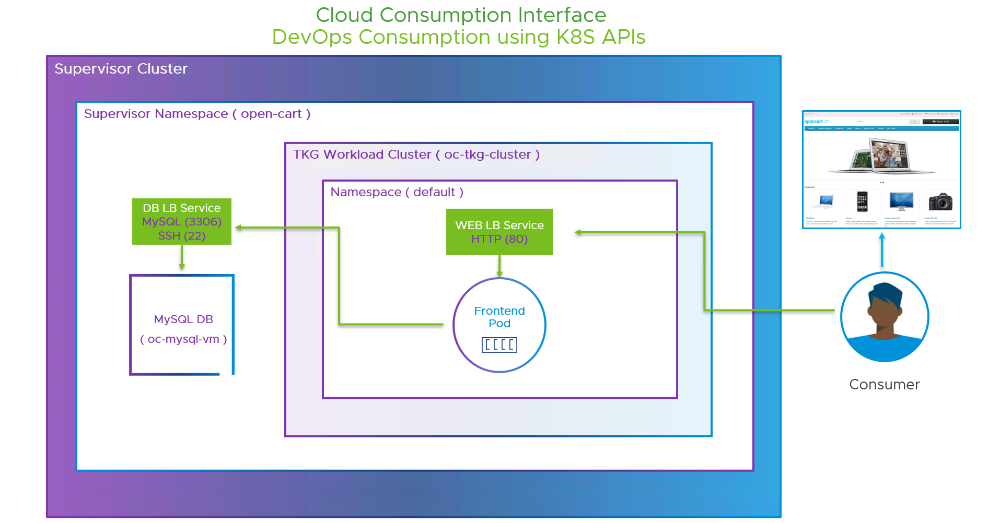

### Instructions to deploy the Opencart Application using Cloud Consumption Interface CCI

## What is CCI ?

Enable a cloud experience that allows developers and other users to independently provision infrastructure services, within limits governed by IT administrators.

Check the following resources for more information on CCI:
- CCI Website: https://bit.ly/41l4Qvh
- CCI Video : https://bit.ly/3UTfiYC
- CCI Blog: https://bit.ly/3UQE8bh
- CCI Documentation: https://bit.ly/3UNKKXW

## What is OpenCart?

Opencart is an easy to-use, powerful, Open Source online store management program that can manage multiple online stores from a single back-end. Administrative area simply by filling in forms and clicking Save. There are many professionally-written extensions available to customize the store to your needs.

For more details, check https://www.opencart.com/


## OpenCart Application Architecture



In this demo we will be leveraging the Cloud Consumption Interface ( CCI for Short) powered by Aria Automation and vSphere+ Subscription to deploy a two tier e-commerece Application called open-cart via deploying a Helm Chart packaged by Bitnami by VMware.

The backend tier will be a Virtual Machine running a MySql Database provisioned on vSphere with Tanzu along with a Load balancer VM Service exposing both MySql on TCP port 3306 and SSH on TCP port 22 leverging the VM Service and VM Operator.


The VM Service and VM Operator within vSphere with Tanzu uses a declarative Kubernetes CRDs based VM provisioning approach, an automatic load balancing service across multiple VMs and an industry standard cloud-init based guest OS customisation all along with administrative controls for things like VM Images (Content Libraries) and VM Classes ( VM Sizing ) for the vSphere administrators.


The frontend tier POD and its Web LB service exposing http on port 80 will be deployed via the Bitnami Helm Chart with custom sets of parameters on a TKG Wordkload Cluster running that is within a dedicated Supervisor namesapce both of which will be provisioned using the Cloud Consumption Interface first

the frontend pod will then connect and use the mySQL as its backend database via the database LB service.

Finaly the consumer can the load the ecommerce website by connecting to the Frontend LB web service via its IP address or FQDN 

## Prerequisites 

1. vSphere with Tanzu vCenter 7 U3i or higher with an enabled Workload management Cluster ( Supervisor)
2. vSphere+ Subscription where the Developer Experience is Enabled which in turn, sets up all the Cloud Consumption Interface building blocks
   Such as ( Projects, Project Role Bindings, Regions, Regionbindings, Supervisor Namesapce Class, Supervisor Namespace Class Config, Supervisor Namespace Class bindings )
3. Access to Aria Automation SaaS .
4. Generated CCI API Token with the minimum required CSP Service roles. Please refer to the documentation here: https://bit.ly/3UNKKXW
5. Download and configure both the Kubectl vSphere plug-in and the Kubectl CCI Plug-in on Linux, Mac or Windows.
6. Kubernetes 1.19+
7. Helm 3.2.0+


## Let's get started 

## 1. Login into CCI as an Admin or User using the K8s CCI plugin

```
export CCI_API_TOKEN=Your_Admin/User_Token
export SERVER=Your_API_Server
kubectl ccs login -t $CCI_API_TOKEN --server $SERVER --skip-set-context --insecure-skip-tls-verify
```
Note: You can find a shell script for the above in cci/Yaml-Examples-And-Scripts/connect-cci-admin.sh or connect-cci-user.sh
      The main difference between the two is that the --skip-set-context parameter is set in the admin script. 

```
API Servers List
================
United States    api.mgmt.cloud.vmware.com
United Kingdom   uk.api.mgmt.cloud.vmware.com
Japan            jp.api.mgmt.cloud.vmware.com
Singapore        sg.api.mgmt.cloud.vmware.com
Germany          de.api.mgmt.cloud.vmware.com
Australia        au.api.mgmt.cloud.vmware.com
Canada           ca.api.mgmt.cloud.vmware.com
Brazil           br.api.mgmt.cloud.vmware.com


## 2. Switch Context to CCS as your default Context

```
kubectl config use-context ccs
```
Note: the CCS context is the CCI managment context where you can create and manage all the CCI building blocks.

## 3. Create a Supervisor Namespace  
( Can also be Done in the Aria Automation Service Broker UI)

```
kubectl create -f oc-svns.yaml
```
Yaml Template Example  
```
apiVersion: infrastructure.ccs.vmware.com/v1alpha1
kind: SupervisorNamespace
metadata:
  name: Your_Supervisor_Namespaces
  namespace: Your_Project_Name
spec:
  description: Your_Description
  regionName: Your_Region_Name
  className: Your_Supervisor_Namespace_Class_Name
  ```

Note: The oc-svns.yaml is included in the git repo.( Modify it according to your setup)

## 4. Create your context 

```
kubectl ccs set-context --project moad --supervisor-namespace open-cart
```
Note: You only have to create your context if you login with --skip-set-context option.
      Without it the context will be auto created based on your project membership when you login into cci.

## 5. Switch Context to your Supervisor Name ccs:moad:open-cart as your default context.

```
kubectl config use-context ccs:moad:open-cart
```

## 6. Deploy your MySQL Database using VM Service 
( Can also be Done in the Aria Automation Service Broker UI)

```
kubectl create -f oc-mysql-vm.yaml
```
Note: This will create the MySQL VM and the MySQL VM Service
      The oc-mysql-vm.yaml is included in the git repo ( Modify it according to your setup)

Document the MySQL Service assigned External IP -> 10.176.193.6 by running :
```
kubectl get vm,vmservice,service -o wide

NAME                                            POWERSTATE   CLASS               IMAGE                                PRIMARY-IP   AGE
virtualmachine.vmoperator.vmware.com/oc-mysql   poweredOn    best-effort-small   ubuntu-18.04-server-cloudimg-amd64                83s

NAME                                                              TYPE           AGE
virtualmachineservice.vmoperator.vmware.com/oc-mysql-vm-service   LoadBalancer   83s

NAME                          TYPE           CLUSTER-IP    EXTERNAL-IP    PORT(S)                       AGE   SELECTOR
service/oc-mysql-vm-service   LoadBalancer   10.96.0.152   10.176.193.6   3306:30292/TCP,22:32217/TCP   83s   <none>
```

## 7. Deploy a TKG Cluster within the open-cart Supervisor Namespace
( Can also be Done in the Aria Automation Service Broker UI)

```
kubectl create -f oc-tkg-cluster.yaml
```
Note: The oc-tkg-cluster.yaml is included in the git repo ( Modify it according to your setup)

Yaml Template Example
```
apiVersion: run.tanzu.vmware.com/v1alpha2
kind: TanzuKubernetesCluster
metadata:
  name: Your_Cluster_Name
  labels:
    tkgs-cluster-selector: Your_Cluster_Name
spec:
  settings:
    network:
      cni:
        name: antrea
      pods:
        cidrBlocks:
          - 192.168.156.0/20
      services:
        cidrBlocks:
          - 10.96.0.0/12
      serviceDomain: cluster.local
    storage:
      classes:
        - Your_storage_policy
      defaultClass: Your_storage_policy       #Default PVC storage class
  topology:
    controlPlane:
      replicas: 1
      vmClass: Your_VM_Class
      storageClass: Your_storage_policy                
      tkr:
        reference:
          name: Your_Tanzu_Kubernetes_Release
    nodePools:
      - name: oc-tkg-cluster-nodepool-qzyl
        replicas: 1
        vmClass: Your_VM_Class
        storageClass: Your_storage_policy
        tkr:
          reference:
            name: Your_Tanzu_Kubernetes_Release

```
## 8. Login into your TKG Cluster using the K8s vSphere Plugin 

```
export SC_IP=Your_Supervisor_IP
export NAMESPACE=Your_Namespace
export KUBECTL_VSPHERE_PASSWORD=Your_vSphere_Password
kubectl vsphere login --server=https://$SC_IP --tanzu-kubernetes-cluster-name Your_TKG_Cluster_Name --tanzu-kubernetes-cluster-namespace $NAMESPACE --vsphere-username Your_vSphere_Username --insecure-skip-tls-verify
```

## 9. Switch Context to your TKG Cluster as your default context.

```
kubectl config use-context ccs:moad:open-cart
```
Note: You will be automatically switched to your TKG Cluster Context upon login but you can always return back to your TKG Context 

## 10. Create an allow all Pod Security Policy
This shouldn't be done in production, but for a quick start, this will bind all authenticated users to run any type of container

```
kubectl create clusterrolebinding default-tkg-admin-privileged-binding --clusterrole=psp:vmware-system-privileged --group=system:authenticated
```

## 11. Deploy the Opencart Frontend using Helm packaged by Bitnami

https://bitnami.com/stack/opencart/helm

Bitnami makes it easy to get your favorite open source software up and running on any platform, including your laptop, Kubernetes and all the major clouds. In addition to popular community offerings, Bitnami, now part of VMware, provides IT organizations with an enterprise offering that is secure, compliant, continuously maintained and customizable to your organizational policies.

Read more about the installtion in the Github: https://github.com/bitnami/charts/tree/main/bitnami/opencart/#installing-the-chart

### A. Add the bitnami repo:

```
# helm repo add bitnami https://charts.bitnami.com/bitnami
```

### B. Install the Opencart Helm chart with Custom options to disable the embedded Maria Database and specify our own parameters

for the Opencart username and password, the MySQL External Database, the Configured MySQL Database username and password and finally the database name. 
```
helm install --namespace default my-open-cart bitnami/opencart --set opencartUsername="demouser",opencartPassword="VMware1!",externalDatabase.host="10.176.193.6",externalDatabase.user="ocuser",externalDatabase.password="VMware1!",externalDatabase.database="opencart",mariadb.enabled="false"
```
Note: The External Database IP is from step 4, the IP address for the MySQL Service provisioned via the VM Service.

Follow the Helm chart instructions ( Don’t Copy anything out of this example output )

Output Example :
```
1. Get the OpenCart URL by running:

  NOTE: It may take a few minutes for the LoadBalancer IP to be available.
        Watch the status with: 'kubectl get svc --namespace default -w my-open-cart-opencart'

  export APP_HOST=$(kubectl get svc --namespace default my-open-cart-opencart --template "{{ range (index .status.loadBalancer.ingress 0) }}{{ . }}{{ end }}")
  export APP_PASSWORD=$(kubectl get secret --namespace default my-open-cart-opencart -o jsonpath="{.data.opencart-password}" | base64 -d)
  export DATABASE_ROOT_PASSWORD=$(kubectl get secret --namespace default my-open-cart-opencart-externaldb -o jsonpath="{.data.mariadb-root-password}" | base64 -d)
  export APP_DATABASE_PASSWORD=$(kubectl get secret --namespace default my-open-cart-opencart-externaldb -o jsonpath="{.data.mariadb-password}" | base64 -d)

2. Complete your OpenCart deployment by running:

  ## PLEASE UPDATE THE EXTERNAL DATABASE CONNECTION PARAMETERS IN THE FOLLOWING COMMAND AS NEEDED ##

  helm upgrade --namespace default my-open-cart my-repo/opencart \
    --set opencartPassword=$APP_PASSWORD,opencartHost=$APP_HOST,service.type=LoadBalancer,mariadb.enabled=false,externalDatabase.host=10.176.193.6,externalDatabase.user=ocuser,externalDatabase.password=VMware1!,externalDatabase.database=opencart
 ```   

### C. Document the LoadBalancer IP once its generated - > 10.176.193.17 by running :

```
kubectl get svc --namespace default -w my-open-cart-opencart
NAME                    TYPE           CLUSTER-IP     EXTERNAL-IP     PORT(S)                      AGE
my-open-cart-opencart   LoadBalancer   10.96.69.234   10.176.193.17   80:30049/TCP,443:32309/TCP   2m3s
```
Note: Press Ctrl-C when the External-IP is populated to get out of watch parameter

### D. Execute the 4 provided Export commands to use with the upgrade command variables being used in the next step

```
export APP_HOST=$(kubectl get svc --namespace default my-open-cart-opencart --template "{{ range (index .status.loadBalancer.ingress 0) }}{{ . }}{{ end }}")
export APP_PASSWORD=$(kubectl get secret --namespace default my-open-cart-opencart -o jsonpath="{.data.opencart-password}" | base64 -d)
export DATABASE_ROOT_PASSWORD=$(kubectl get secret --namespace default my-open-cart-opencart-externaldb -o jsonpath="{.data.mariadb-root-password}" | base64 -d)
export APP_DATABASE_PASSWORD=$(kubectl get secret --namespace default my-open-cart-opencart-externaldb -o jsonpath="{.data.mariadb-password}" | base64 -d)
```

### E. Complete your OpenCart deployment by running the Helm upgrade so we can update our deployement with the Application service IP ( aka $APP_HOST )

```
helm upgrade --namespace default my-open-cart bitnami/opencart --set opencartPassword=$APP_PASSWORD,opencartHost=$APP_HOST,service.type=LoadBalancer,mariadb.enabled="false",externalDatabase.host="10.176.193.6",externalDatabase.user="ocuser",externalDatabase.password="VMware1!",externalDatabase.database="opencart"
```
Note: Will need to do a few updates to the command line similar to the above upgrade command before you execute the helm upgrade command. you need to update your repo to bitnami/opencart instead of my-repo/opencart and add double quotes to all the values except the variables. 

Once Executed you will have the generated OpenCart URL

Output Example :
```
helm upgrade --namespace default my-open-cart bitnami/opencart --set opencartPassword=$APP_PASSWORD,opencartHost=$APP_HOST,service.type=LoadBalancer,mariadb.enabled=false,externalDatabase.host="10.176.193.6",externalDatabase.user="ocuser",externalDatabase.password="VMware1!",externalDatabase.database="opencart"
Release "my-open-cart" has been upgraded. Happy Helming!
NAME: my-open-cart
LAST DEPLOYED: Wed Apr 19 08:27:34 2023
NAMESPACE: default
STATUS: deployed
REVISION: 2
TEST SUITE: None
NOTES:
CHART NAME: opencart
CHART VERSION: 13.0.12
APP VERSION: 4.0.1-1

** Please be patient while the chart is being deployed **1. Get the OpenCart URL by running:

  echo "Store URL: http://10.176.193.17/"
  echo "Admin URL: http://10.176.193.17/admin"

2. Get your OpenCart login credentials by running:

  echo Admin Username: user
  echo Admin Password: $(kubectl get secret --namespace default my-open-cart-opencart -o jsonpath="{.data.opencart-password}" | base64 -d)
```

### F. Query your Opencart Objects before accessing the Opencart application to make sure the open cart is running

```
kubectl get all

NAME                                         READY   STATUS    RESTARTS   AGE
pod/my-open-cart-opencart-7cd46d854c-rlkjp   1/1     Running   0          81s

NAME                            TYPE           CLUSTER-IP     EXTERNAL-IP     PORT(S)                      AGE
service/kubernetes              ClusterIP      10.96.0.1      <none>          443/TCP                      123m
service/my-open-cart-opencart   LoadBalancer   10.96.75.187   10.176.193.17   80:32532/TCP,443:31356/TCP   2m7s
service/supervisor              ClusterIP      None           <none>          6443/TCP                     123m

NAME                                    READY   UP-TO-DATE   AVAILABLE   AGE
deployment.apps/my-open-cart-opencart   1/1     1            1           81s

NAME                                               DESIRED   CURRENT   READY   AGE
replicaset.apps/my-open-cart-opencart-7cd46d854c   1         1         1       81s
```
```
kubectl get pvc
NAME                             STATUS   VOLUME                                     CAPACITY   ACCESS MODES   STORAGECLASS                    AGE
my-open-cart-opencart-opencart   Bound    pvc-5eedeed0-db29-40e6-b05a-4d32d4e1ddbd   8Gi        RWO            tmm-kubernetes-storage-policy   3m32s
```
```
kubectl get secrets
NAME                                 TYPE                                  DATA   AGE
default-token-j8r9z                  kubernetes.io/service-account-token   3      126m
my-open-cart-opencart                Opaque                                1      5m4s
my-open-cart-opencart-externaldb     Opaque                                1      5m4s
sh.helm.release.v1.my-open-cart.v1   helm.sh/release.v1                    1      5m4s
sh.helm.release.v1.my-open-cart.v2   helm.sh/release.v1                    1      4m18s
```

### G. Once you verify the pods and service are ready, Hit the generated Store URL: http://10.176.193.17/

### H. To delete your application

```
helm delete --namespace default my-open-cart
```

## Happy Cloud Consumption!